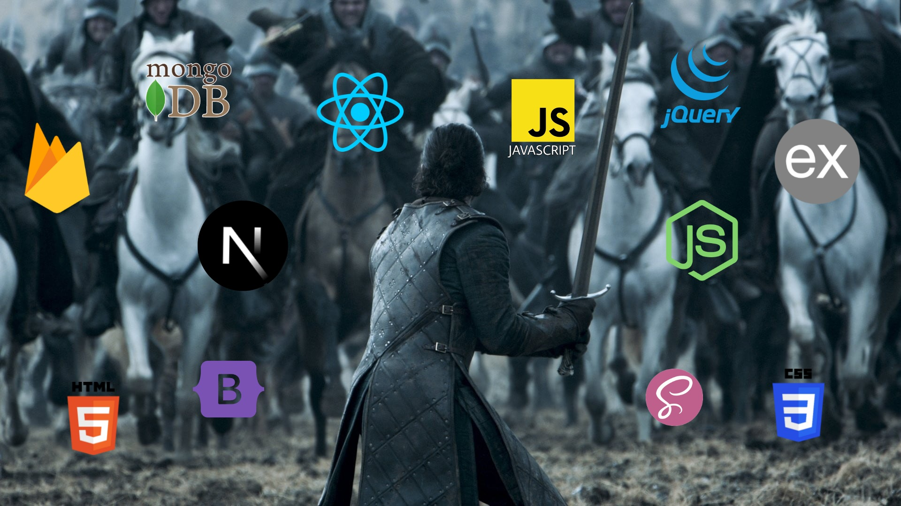

<h1 align="center">Hello there, I'm Uttam Verma.</h1>
<h3 align="center">Focusing on MERN Stack</h3>

  

### Send Word

Should thou wish to speak, send a raven to:
uttam.verma.developer@gmail.com  
or  
imuv21@gmail.com  

*Whispers carried by the Three-Eyed Raven are also received.*

---

### Of My Craft

For over two years and six moons, I have forged and maintained scalable web applications using the arts of React.js, Node.js, Express.js, MongoDB, and JavaScript.

I write code not merely to function, but to endure.

I value clarity over clutter, structure over chaos, and performance over illusion. Each system I build is shaped with care. APIs tempered like Valyrian steel, interfaces crafted to serve both speed and simplicity.

The realm of full-stack engineering is vast, and I walk it with curiosity, discipline, and an unending hunger to sharpen my craft.

---

<h3 align="left">Arsenal of the Realm</h3>

 

 

---

