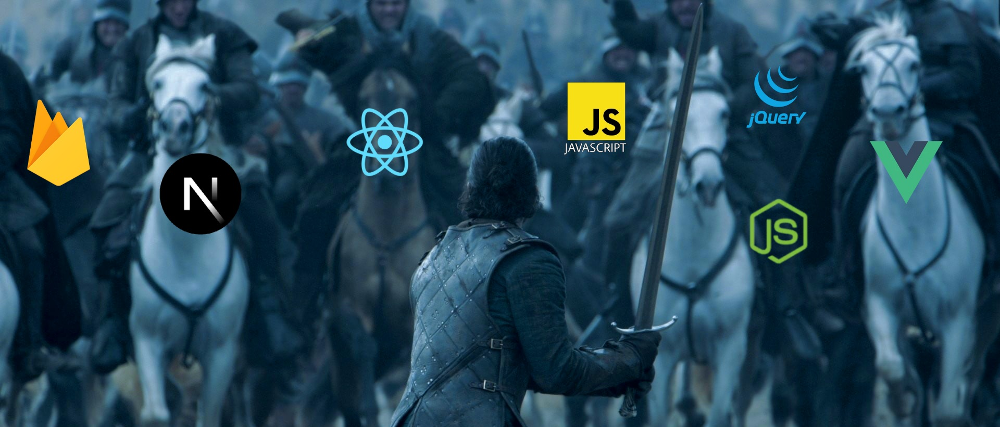

<h1 align="center">Hello there, I'm Uttam Verma as you can see already.</h1>
<h3 align="center"> I'm currently focusing on JavaScript and React.js and the popular frameworks related to them. I like Firebase idk why. Recently I've started learning Node.js also. </h3>

  

How to reach me : uttam.verma.developer@gmail.com or *you can always send a Three-Eyed Raven*

Experience : I have done 4 months internship at UXDLAB. <a href="https://drive.google.com/file/d/1-2leV5D_c7L5QOi-LkOUlShNMZhjaArP/view?usp=drive_link" >Click here</a> to see the certificate. 
<h3 align="left">Languages/Frameworks/Library :</h3>

 
 

 
 
 

 

 
  

 

 
 
 
<h3 align="left">Connect with me:</h3>

&nbsp;

